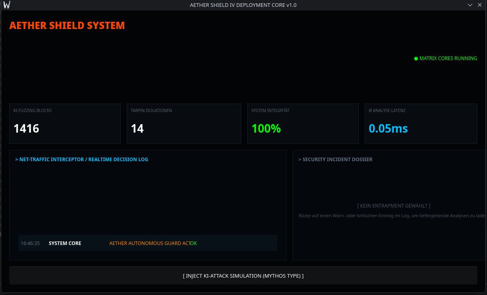

# AETHER SHIELD // DEPLOYMENT CORE v1.0
**AETHER SHIELD** ist ein hochperformantes, automatisiertes Dashboard zur Visualisierung und Steuerung von Sicherheitsinterventionen in Echtzeit innerhalb des **AETHER OS** Ökosystems. Die Software kombiniert die unerbittliche Geschwindigkeit und Speichersicherheit von **Rust** mit der modernen, deklarativen UI-Performance von **Slint**.

Das System überwacht Kernel-Aktivitäten, Netzwerk-Verkehr und Prozess-Entropie, fängt bösartige Aktivitäten (bis hin zu mutierenden KI-Angriffen vom Typ *Mythos*) ab und isoliert die Wirte autonom in kryptografischen Tarpits oder setzt harte Prozess-Kill-Vektoren um.

---

## 🛠️ System-Architektur & Features

### 📡 Realtime Interceptor Log
* **Echtzeit Datensynchronisation:** Vollkommen flüssige UI-Refreshes über native Slint-Datenbindungen (`VecModel`).
* **Forensische Dossier-Akte:** Ein Klick auf eine Bedrohung extrahiert sofort die tiefgehende Verhaltensanalyse des Angreifers.
* **On-the-Fly Schadensbegrenzung:** Direkte Kontroll-Infrastruktur zur Ausführung von Sofortmaßnahmen (`HARD KILL` / `PERMANENT BAN`).

### 🧠 KI-Angriffs-Simulator
* Integrierter Injektor zur Simulation komplexer Bedrohungsszenarien (z.B. *Zero-Day Kernel Exploit Bypasses* oder *Polymorphic Memory Overwrites*).
* Dynamische Abfrage von Live-Systemdaten über die native `sysinfo`-Schnittstelle.

### 💻 Cross-Plattform Core
* **Native Linux Performance:** Entwickelt und optimiert unter **CachyOS** via Wayland/X11.
* **Windows Ready:** Dank der Abstraktion durch Rust und Slint ohne Änderungen am UI-Code direkt für Windows-Umgebungen (DirectX/Win32-API) kompilierbar.

---

## 🚀 Installation & Start (Entwickler-Modus)

### Voraussetzungen

Stelle sicher, dass du die aktuelle Rust-Toolchain sowie die System-Abhängigkeiten installiert hast.

#### Unter CachyOS / Arch Linux:
```bash
sudo pacman -S rustup gcc
rustup default stable
